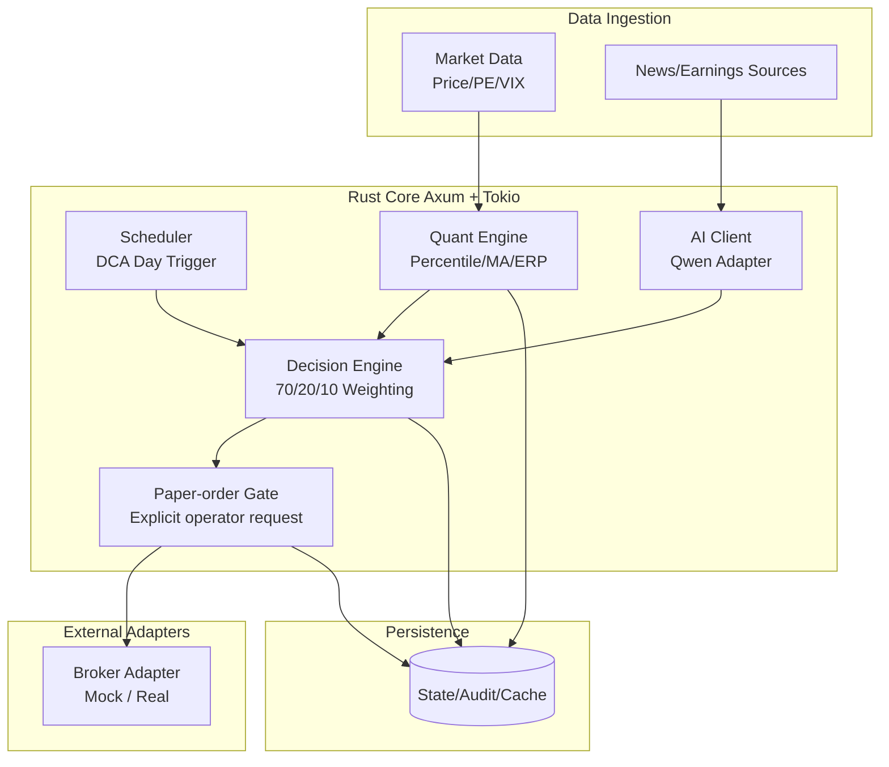

<p align="center">
  
</p>

<p align="center">
  English | <a href="./readme.md">中文文档</a>
</p>

<p align="center">
  <a href="https://github.com/jamesra26/indexlink/blob/main/Cargo.toml"></a>
  <a href="https://github.com/jamesra26/indexlink/releases"></a>
  <a href="https://opensource.org/licenses/MIT"></a>
  <a href="https://github.com/jamesra26/indexlink"></a>
</p>

<p align="center">
  <a href="https://www.rust-lang.org/"></a>
  <a href="https://doc.rust-lang.org/cargo/"></a>
  <a href="https://github.com/jamesra26/indexlink"></a>
  <a href="https://github.com/jamesra26/indexlink/tree/main/crates"></a>
</p>

<p align="center">
  <a href="https://conventionalcommits.org"></a>
  <a href="./CHANGE_LOG.md"></a>
  <a href="./AGENTS.md"></a>
</p>

<p align="center">
  <a href="https://github.com/jamesra26/indexlink/stargazers"></a>
  <a href="https://github.com/jamesra26/indexlink/commits/main"></a>
  <a href="https://github.com/jamesra26/indexlink/graphs/commit-activity"></a>
</p>

<p align="center">
  <a href="https://github.com/jamesra26/indexlink/issues"></a>
  <a href="https://github.com/jamesra26/indexlink/pulls"></a>
  <a href="https://github.com/jamesra26/indexlink/graphs/contributors"></a>
</p>

<p align="center">
  <a href="https://github.com/jamesra26/indexlink/issues">Issue Tracker</a> •
  <a href="./LICENSE">License</a> •
  <a href="./CHANGE_LOG.md">Changelog</a>
</p>

IndexLink is an intelligent dollar-cost averaging (DCA) execution system designed for long-term index investors. Powered by a dual engine of **historical percentile anchors + AI semantic sensing**, it fine-tunes each scheduled investment day: invest more at relative lows, invest less at relative highs, and delay when overheated.

> **Core premise:** We cannot determine whether the market is "undervalued," but we can use data to detect its **position** within a historical distribution. IndexLink measures position only—it does not claim to know fair value. That is the essential difference between **adaptive DCA** and **market-timing speculation**.

---

## Core Philosophy

Traditional DCA becomes rigid in extreme market conditions. IndexLink exists to address:

- **Mechanical full-size buys at historical highs:** When P/E sits at the 90th percentile historically and sentiment is overheated, automatically trigger "delay" or "reduce size."
- **Fixed amounts at historical lows:** When price / ERP percentiles fall in a historical low band, automatically suggest or execute a modest increase within DCA discipline.
- **The "good news is priced in" trap:** Combine earnings-season expectation gaps with macro news to flag "false prosperity."

---

## Decision Model: The 70/20/10 Rule

The system rejects "blind AI fantasy." Every instruction follows this weighted logic:

| Dimension                             | Weight  | Core Indicators                                             | Role of AI                                                                                |
| :------------------------------------ | :------ | :---------------------------------------------------------- | :---------------------------------------------------------------------------------------- |
| **Historical Position (Fundamental)** | **70%** | Shiller P/E, ERP, historical percentiles                    | **Hard constraint:** compute where the current price sits in its historical distribution. |
| **Recent Trend (Technical)**          | **20%** | Distance from 200-day MA, RSI, volatility (VIX)             | **Rhythm control:** detect "catching a falling knife" or "chasing the top."               |
| **Semantic Sensing (Sentiment)**      | **10%** | Earnings expectation gaps, macro news, user-defined sources | **Soft nudge:** use Qwen to infer directional bias behind news and rating changes.        |

---

## Key Features

- 🤖 **Qwen Decision Engine:** Reads key financial news and earnings guidance for the week; identifies expectation gaps.
- 🦀 **Local Rust backend:** Rust (Axum + Tokio) with local SQLite, migrations, health checks, and a fixed-monthly decision-audit scheduler.
- 📊 **Dynamic action space:**
  - **Overweight (+20~50%):** Modest increase within DCA discipline when in a historical low band and not in an extreme sharp decline.
  - **Standard (100%):** Steady execution when in a neutral historical band (roughly 30%~70th percentile).
  - **Tactical Delay:** Suggest delaying 3–5 days due to major news (e.g. NFP, FOMC) or technical overheating.
  - **Underweight (-50%) / Skip:** Reduce size or sit out when in a historical high band or under systemic risk.
- 🔌 **Paper-trading interface:** Mock mode and local loopback Futu/Moomoo OpenD paper accounts; live trading is not implemented.
- 📜 **Transparent audit log:** Each automatic or manual Decision Preview writes an AI Decision Record; an order is optional and requires an explicit operator request.

> **Current demo status (2026-07):** the local SQLite demo now has a fixed-monthly UTC scheduler that writes one idempotent automatic decision record per due plan/day. It fetches server-side 70/20 market inputs and bounded Qwen evidence, but **never submits an order automatically**. Paper orders require an explicit operator request and are limited to MockBroker or local loopback Futu/Moomoo OpenD paper accounts. The next planned scheduling model is a configurable 1–31 day review interval plus per-plan monthly budget controls; it is not implemented yet.

---

## Technical Architecture

### Design Principles

1. **Determinism first, AI constrained:** 70% + 20% are pure, reproducible computations; the 10% AI layer only nudges within bounded limits. If AI is unavailable, degrade to 90/10/0 and keep running.
2. **Position language in the data model:** Core output is historical percentile, not value judgment.
3. **Financial reliability triad:** **Idempotency** (no duplicate orders on the same DCA day), **audit** (every decision replayable), **circuit breaker** (default to Skip on anomalies, never reckless investing).
4. **Decision vs. execution separation:** Decision computation and order placement are two stages; user confirmation can sit in between.

### Layered Overview



### Module Responsibilities

| Module                     | Weight    | Responsibility                                                                                                                                |
| :------------------------- | :-------- | :-------------------------------------------------------------------------------------------------------------------------------------------- |
| **Scheduler**              | —         | Trigger DCA-day decisions via Tokio + persistent task table; idempotency key; survives process restarts.                                      |
| **Quant Engine**           | 70% + 20% | Convert all indicators to percentiles within their own historical distributions; pure functions, no IO, shared by live trading and backtests. |
| **AI Client**              | 10%       | Wrap Qwen; output bounded sentiment offset `sentiment ∈ [-1, +1]`; return 0 on timeout/parse failure (degraded mode).                         |
| **Decision Engine**        | —         | Combine 70/20/10 into a composite score, map to DCA multiplier, emit `Decision` with input snapshot.                                          |
| **Paper-order gate**       | —         | Decision → optional operator-supplied paper order; without it, only audit evidence is created. Scheduler never submits orders.                |
| **Broker Adapter**         | —         | One trait with paper-only implementations: `MockBroker` and local loopback Futu/Moomoo OpenD.                                                  |

### Decision Pipeline

```text
Composite score S = 0.70 * f_value(percentile)     // historical position, dominant
                  + 0.20 * f_trend(MA/RSI/VIX)     // rhythm
                  + 0.10 * sentiment               // bounded AI nudge

Multiplier = clamp( map(S), 0.0, x )               // upper bound x is user-configurable; lower bound Skip
```

- When **low but sharply falling**, `f_trend` applies a negative correction—"don't catch a falling knife"; increases stay conservative.
- `clamp` is a hard safety bound: regardless of AI output, the multiplier always stays within `[0, 1.5]`.
- Actions (Overweight / Standard / Delay / Underweight / Skip) are labels for multiplier bands.

### Project Structure (Cargo Workspace)

```text
indexlink/
├─ crates/
│  ├─ core-domain/      # Types: Decision, Action, Percentile (no IO)
│  ├─ quant-engine/     # 70%+20% pure computation (no IO)
│  ├─ ai-client/        # Qwen adapter + degradation logic
│  ├─ decision-engine/  # 70/20/10 synthesis + mapping
│  ├─ investment-plans/ # Fixed-monthly plans and execution preview
│  ├─ decision-records/ # Auditable decision-record port
│  ├─ market-data/      # Automatic 70/20 input provider
│  ├─ broker/           # Broker trait + Mock/OpenD paper impl
│  ├─ storage/          # DB access (audit/state/cache)
│  └─ api/              # Axum HTTP layer
└─ apps/
   ├─ server/           # Binary entrypoint and minimum scheduler
   └─ web/              # Vite + React demo UI
```

> `quant-engine` and `decision-engine` stay pure and IO-free. The current historical chart is deliberately a simplified MA200 price-rule replay, not a complete historical 70/20/10 reconstruction.

### Persistence & Audit

| Table          | Purpose                                                             |
| :------------- | :------------------------------------------------------------------ |
| `investment_plans` | DCA instruments, fixed monthly execution day, base amount and cap |
| `decision_records` | Each decision + **input snapshot**, Qwen evidence, request/ack and readable summary |
| `scheduled_decision_runs` | One UTC-day claim per plan for the audit scheduler |
| `paper_orders` / `paper_fills` / `portfolio_snapshots` | Local paper ledger reconstructed from observed OpenD order changes |

> Audit principle: **store inputs, not just conclusions**—persist percentiles, trend signals, sentiment, and weights at decision time so you can answer "why did we add 30% that day?"

### Reliability & Safety

- **Idempotency:** `(plan_id, UTC date)` prevents duplicate automatic audit records after scheduler ticks or restarts.
- **Safe market-data failure:** Missing 70/20 data prevents automatic audit creation; no synthetic decision is written.
- **Degradation chain:** AI down → explicit 90/10/0 decision mode; market feed down → no automatic decision; no retrying order is manufactured.
- **Amount safety:** Hard-coded multiplier and single-execution caps; AI cannot override either.
- **Paper-only execution:** The scheduler never submits an order. A paper order requires an explicit operator request, a due plan, and an executable action.

### Phased Rollout

1. **Completed demo MVP:** local SQLite, automatic 70/20 data, bounded Qwen evidence, 70/20/10 decisions, audit records, a fixed-monthly scheduler, paper-order confirmation, and a local OpenD paper-account view.
2. **Next:** configurable 1–31 day review intervals, per-plan monthly budgets, missed-run policies, and delayed re-evaluation.
3. **Not in scope:** automatic or live orders, cloud sync, multi-user access, tax/FX/dividend treatment, and a complete historical 70/20/10 replay.

---

## Disclaimer

> **This project is for learning and technical research only. It does not constitute investment advice.**

- **Not investment advice:** All decisions, multipliers, and signals from IndexLink are quantitative outputs based on historical data. They are not buy/sell recommendations and do not predict market direction.
- **No guarantee of returns:** Index investing carries risk of loss. Historical percentiles and backtest results **do not predict** future performance. You bear full responsibility for any investment decisions made using this system.
- **Adaptive ≠ market timing:** This system measures price **position** within a historical distribution only. It does **not** claim to judge whether the market is "undervalued" or "overvalued," and cannot guarantee "buying the bottom."
- **Use at your own risk:** Before connecting a real broker API, fully understand the code and risks, and test thoroughly. The authors are not liable for any direct or indirect losses from use of this software.
- **Compliance:** Automated trading may be restricted by laws and broker terms in your jurisdiction. Confirm compliance before use.

---

## Copyright and contributors

Copyright © 2026 IndexLink Contributors. The project is released under the [MIT License](./LICENSE); the original copyright notice in the license text remains unchanged.

- Jame — original author and repository maintainer.
- Xuanzhou Gu — backend, SQLite persistence, OpenD paper trading, decision records, and demo-loop contributions.
- Yucong Peng — project contributor.
