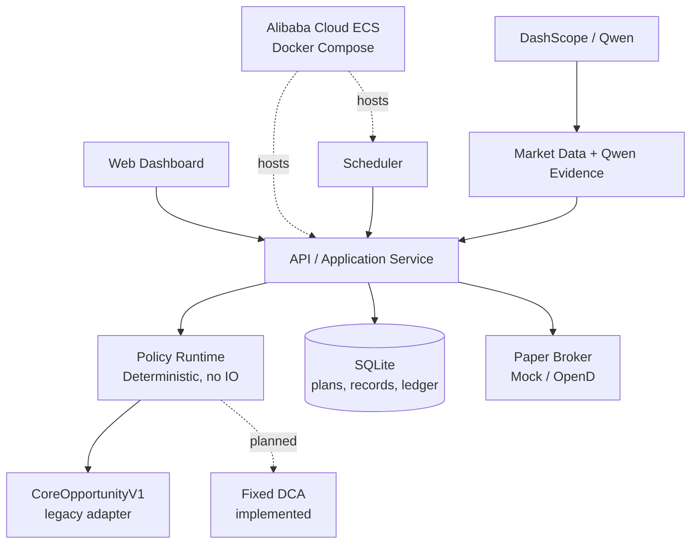

<p align="center">
  
</p>

<p align="center">
  <a href="./readme.md">中文文档</a> | English
</p>

<p align="center">
  <a href="./LICENSE"></a>
  <a href="./CHANGE_LOG.md"></a>
  <a href="./STRATEGY_STUDIO_MIGRATION_PLAN.md"></a>
</p>

# IndexLink

IndexLink is a **transparent, auditable, extensible quantitative DCA strategy studio and paper-trading execution platform** for long-term investors. It helps students and working professionals with limited budgets preserve a traceable answer to “why was this suggested, was it executed, and what actually happened?” rather than presenting opaque judgement as investment advice.

The project is currently a demo MVP. It runs locally with SQLite or on Alibaba Cloud ECS, creates investment plans, retrieves market inputs, produces bounded Qwen explanations, stores decision evidence, reads a paper account, and submits a paper order to MockBroker or a local Futu/Moomoo OpenD **paper account** only after an explicit operator request.

> **No outperformance promise.** IndexLink does not predict markets, determine intrinsic value, or guarantee returns. Fixed DCA remains the required fair benchmark; every policy must be validated under matched cash flows, costs, data, and execution timing.

## Product Goal

The target is not one formula but a reproducible strategy lifecycle:

```text
Create Strategy → Validate → Backtest → Review → Save Version → Activate
→ Schedule → Evaluate → Paper Execute → Monitor → Audit
```

| Goal | Meaning |
| :--- | :--- |
| **Transparent** | Users can inspect the policy version, evidence, recommended amount, warnings, and order acknowledgement. |
| **Auditable** | Each decision retains input snapshots, policy reference, Qwen rationale, order data, and related fill observations. |
| **Reproducible** | The same policy version and complete context must produce the same recommendation; history and live use the same deterministic runtime. |
| **Extensible** | Built-in policies, fixed DCA, and later restricted DSL policies share one execution and audit boundary. |
| **Safe** | Paper trading only; the scheduler creates audit records but never submits orders; AI has no trading authority. |

See the [Strategy Studio Migration Plan](./STRATEGY_STUDIO_MIGRATION_PLAN.md) for the complete target design, compatibility rules, and PR sequence.

## Current Implementation and Policy Research

The current demo still includes the historical 70/20/10 decision path: fundamental/historical-position, trend, and bounded Qwen sentiment produce a recommendation and evidence. This is the candidate semantics of `CoreOpportunityV1`; it is **not** a proven claim of superior returns.

The repository keeps C1–C4, calibration fixtures, and reports as reproducible research assets. Under matched fixed-DCA historical samples, some candidates primarily changed cash utilisation, drawdown, or volatility and did not establish a stable return advantage. The legacy model is now retained as a versioned built-in policy, and `FixedDcaPolicy` is the new-plan default and fair benchmark; the restricted DSL and Strategy Studio remain unimplemented.

| Capability | Current state | Boundary |
| :--- | :--- | :--- |
| Plans, schedule rules, and local SQLite | Implemented | Single-user local data; existing plans retain their current behaviour. |
| 70/20 market inputs and Qwen evidence | Implemented | Source failure is explicit degradation or a rejected automatic decision, never fabricated input. |
| Decision evidence and history | Implemented | Stores inputs, result, Qwen rationale/news/warnings, and optional order acknowledgement. |
| Minimum scheduler | Implemented | Creates idempotent evidence on due dates; **never auto-submits an order**. |
| Two-bucket budget, opportunity cash, and period constraints | Base loop implemented | Constrained by plan budget, available cash, period caps, and paper-only boundaries. |
| Mock/OpenD paper trading | Implemented | Local-loopback OpenD paper accounts only; no live trading. |
| Built-in policies and unified execution entry | Implemented | New plans default to `fixed_dca@1`; existing SQLite plans migrate to `core_opportunity_v1@1`; preview, scheduler, audit, and paper-only orders use the same resolver. |
| Policy registry / DSL Studio | Planned | Only supported built-in policies can be selected today; see the migration plan. |

## Architecture and Safety Boundaries

IndexLink uses **Hexagonal Architecture + Modular Monolith**. Domain policies remain pure functions; network, database, Qwen, market data, and brokers remain outside the adapter boundary.


```mermaid
graph TD
    WEB[Web Dashboard]
    SCH[Scheduler]
    API[API / Application Service]
    POLICY[Policy Runtime\nDeterministic, no IO]
    LEGACY[CoreOpportunityV1\nlegacy adapter]
    DCA[Fixed DCA\nimplemented]
    EVIDENCE[Market Data + Qwen Evidence]
    RECORDS[(SQLite\nplans, records, ledger)]
    BROKER[Paper Broker\nMock / OpenD]
    ECS[Alibaba Cloud ECS\nDocker Compose]
    QWEN[DashScope / Qwen]

    WEB --> API
    SCH --> API
    API --> POLICY
    POLICY --> LEGACY
    POLICY -. planned .-> DCA
    EVIDENCE --> API
    API --> RECORDS
    API --> BROKER
    ECS -. hosts .-> API
    ECS -. hosts .-> SCH
    QWEN --> EVIDENCE
```

Key constraints:

- **No I/O in policy runtime:** a policy receives resolved context only. It cannot query a database, call the network, read secrets, or place an order.
- **AI is bounded:** Qwen produces explanations, warnings, and policy candidates. It cannot bypass validation, budget, operator confirmation, or paper-only restrictions.
- **Order safety:** only an explicit, due, validated paper-order request can be submitted. There is no live trading, automated cancellation, or scheduler auto-ordering.
- **Audit first:** retain inputs rather than conclusions only. Future records will append policy ID, version, snapshot, and hash while old records remain readable.

## Current Workspace

```text
indexlink/
├─ crates/
│  ├─ core-domain/          # Amount, Action, Percentile and other invariant types
│  ├─ quant-engine/         # Current percentile, fundamental, and trend pure functions
│  ├─ decision-engine/      # Current 70/20/10 legacy decision implementation
│  ├─ investment-plans/     # Plans, schedules, two-bucket budget, execution preview
│  ├─ decision-records/     # Auditable decision-record port
│  ├─ market-data/          # Market-input providers
│  ├─ ai-client/            # DashScope/Qwen adapter and degradation
│  ├─ broker/               # Mock/OpenD paper-only adapters
│  ├─ storage/              # SQLite and persistence adapters
│  ├─ strategy-evaluation/  # Offline, versioned policy research
│  └─ api/                  # Axum HTTP and application orchestration
├─ apps/
│  ├─ server/               # Composition root and scheduler
│  └─ web/                  # Vite + React dashboard
├─ STRATEGY_STUDIO_MIGRATION_PLAN.md
└─ deployment/aliyun/       # ECS Docker Compose deployment scripts
```

> The migration will add `strategy-policy` for the policy contract and a restricted Strategy DSL. Arbitrary user scripts will never enter the runtime.

## Run Locally

1. Install stable Rust, `rustfmt`, `clippy`, and pnpm.
2. Create local configuration and start the server:

   ```bash
   cp .env.example .env
   cargo run -p indexlink-server
   ```

3. Check health:

   ```bash
   curl http://localhost:8080/health
   curl http://localhost:8080/ready
   ```

4. Start the web app:

   ```bash
   pnpm --dir apps/web install --frozen-lockfile
   pnpm --dir apps/web dev
   ```

The local `.env` is Git-ignored. `DASHSCOPE_API_KEY` is optional Qwen evidence configuration; `OPEND_PROVIDER`, `OPEND_HOST`, `OPEND_PORT`, and `OPEND_ACCOUNT_ID` are only for a local-loopback OpenD paper account. None may be committed or logged.

### Docker / Alibaba Cloud ECS

The project can run on Alibaba Cloud ECS with Docker Compose. SQLite is persisted in a local Docker volume:

```bash
docker compose -f deployment/docker-compose.yml up --build -d
docker compose -f deployment/docker-compose.yml ps
curl http://127.0.0.1:8080/ready
```

See [deployment/aliyun/README.md](./deployment/aliyun/README.md) for deployment instructions.

## Roadmap

1. **Policy contract and legacy wrapper:** completed: the generic `InvestmentPolicy` contract wraps legacy logic as `CoreOpportunityV1` and locks its behaviour with regression tests.
2. **Fixed DCA and unified resolver:** completed; fixed DCA and the legacy policy run through one preview, scheduler, audit, and paper-only flow.
3. **Policy versions and restricted DSL:** next, save, validate, backtest, version, and activate allow-listed rule policies.
4. **Unified evaluation and Studio:** use the same runtime for historical and live execution; show comparable XIRR, terminal wealth, drawdown, volatility, Sortino, and cash utilisation.
5. **Qwen Copilot:** generate candidate specifications and explanations, always subject to deterministic validation, backtesting, and human review.

See [STRATEGY_STUDIO_MIGRATION_PLAN.md](./STRATEGY_STUDIO_MIGRATION_PLAN.md) for details.

## Disclaimer

> This project is for learning, technical research, and paper-trading demonstrations only. It is not investment advice.

- Every policy can lose money; historical results do not predict future returns.
- A policy without demonstrated, reproducible advantage must not be marketed as “improving returns” or “beating the market.”
- Users are responsible for understanding policy logic, data sources, delays, costs, taxes, regulatory obligations, and trading risk.
- No live-trading function is provided, and AI never receives order authority.

## Copyright and Contributors

Copyright © 2026 IndexLink Contributors. Released under the [MIT License](./LICENSE).

- Jame — original project author and repository maintainer.
- Xuanzhou Gu — backend, SQLite persistence, OpenD paper trading, decision evidence, strategy research, and demo-loop contributions.
- Yucong Peng — project contributor.
