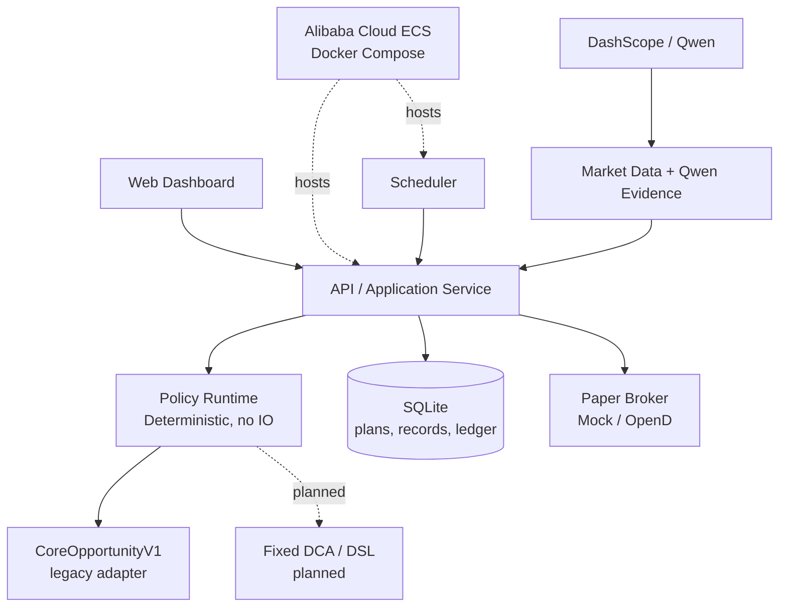

<p align="center">
  
</p>

<p align="center">
  中文文档 | <a href="./readme.en.md">English</a>
</p>

<p align="center">
  <a href="./LICENSE"></a>
  <a href="./CHANGE_LOG.md"></a>
  <a href="./STRATEGY_STUDIO_MIGRATION_PLAN.md"></a>
</p>

# IndexLink

IndexLink 是一个面向长期投资者的**透明、可审计、可扩展的量化定投策略工作台与 paper-trading 执行平台**。它帮助资金有限、希望长期坚持纪律的学生和上班族，把“计划为什么这样建议、是否执行、实际发生了什么”保留为可追溯记录，而不是把黑箱判断包装成投资建议。

项目当前仍是 demo MVP：可在本地 SQLite 或 Alibaba Cloud ECS 上运行，创建定投计划、拉取市场输入、获得受限 Qwen 解释、生成决策存证、查看模拟账户，并在操作者明确确认后向 MockBroker 或本机 Futu/Moomoo OpenD **模拟账户**提交 paper order。

> **不承诺跑赢。** IndexLink 不预测市场，不判断“真实价值”，不保证收益。固定 DCA 是必须保留的公平基准；任何策略都必须在匹配的资金流、成本、数据和执行时点下接受验证。

## 产品目标

目标体验不是单一公式，而是一个可复现的策略生命周期：

```text
创建策略 → 验证 → 回测 → 审阅 → 保存版本 → 激活 → 调度
→ 评估 → Paper 执行 → 监控 → 审计
```

| 目标 | 含义 |
| :--- | :--- |
| **透明** | 使用者能看到策略版本、输入证据、推荐金额、风险提示和订单回执。 |
| **可审计** | 每次决策保存输入快照、策略引用、Qwen 理由、订单和成交相关记录。 |
| **可复现** | 相同策略版本与完整上下文必须得到相同推荐；历史与实时使用同一确定性运行时。 |
| **可扩展** | 内置策略、固定 DCA 和后续受限 DSL 策略共享同一执行与审计边界。 |
| **安全** | 仅支持 paper trading；scheduler 只生成审计，不能自动下单；AI 不拥有交易授权。 |

完整迁移设计、兼容策略和 PR 拆分见 [策略工作台迁移计划](./STRATEGY_STUDIO_MIGRATION_PLAN.md)。

## 当前实现与策略研究

当前生产演示仍包含历史的 70/20/10 决策路径：基本面/历史位置、趋势和受限 Qwen 情绪用于生成建议及证据。这是现有的 `CoreOpportunityV1` 候选语义，**不是经证明能提高收益的默认承诺**。

仓库保留 C1–C4、校准夹具和报告，以记录真实的研究结果与失败候选：在匹配固定 DCA 的历史样本中，部分候选主要改变现金使用率、回撤或波动，并未稳定形成收益优势。后续会把旧模型包装成版本化内置策略，同时增加 `FixedDcaPolicy` 作为新计划的默认候选和对照基准；这一迁移尚未实现。

| 能力 | 当前状态 | 边界 |
| :--- | :--- | :--- |
| 计划管理、周期规则与本地 SQLite | 已完成 | 单用户、本地数据；已有计划保持现有行为。 |
| 70/20 市场输入与 Qwen 证据 | 已完成 | 外部源不可用时明确降级或拒绝本次自动决策，不伪造输入。 |
| 决策存证与历史查询 | 已完成 | 保存输入、结果、Qwen 理由/新闻/警告及可选订单回执。 |
| 最小 scheduler | 已完成 | 到期时幂等生成存证；**从不自动下单**。 |
| 双桶预算、机会现金与周期约束 | 已完成基础闭环 | 受计划预算、可用现金、周期上限和 paper-only 边界约束。 |
| Mock/OpenD paper trading | 已完成 | 仅 loopback OpenD 模拟账户；不支持实盘。 |
| 策略契约与 `CoreOpportunityV1` 包装 | 已完成 | 无 IO 的通用契约已建立；旧 70/20/10 行为保持不变，尚未接入计划选择。 |
| 固定 DCA policy / 策略版本库 / DSL Studio | 计划中 | 见迁移计划；不得表述为已经完成。 |

## 架构与安全边界

IndexLink 采用 **Hexagonal Architecture + Modular Monolith**。领域策略保持纯函数；网络、数据库、Qwen、市场数据和 Broker 均在适配器边界之外。



关键约束：

- **策略运行时无 IO**：策略只接收已解析的上下文，不能直接读数据库、调用网络、读取密钥或下单。
- **AI 受限**：Qwen 输出解释、风险提示和候选草案；不能越过验证、预算、人工确认或 paper-only 限制。
- **订单安全**：只有操作者显式请求的、到期且已验证的 paper order 才能提交；不支持实盘、自动撤单或 scheduler 自动下单。
- **审计优先**：记录输入而非只记录结论；后续记录会追加策略 ID、版本、快照和哈希，旧记录保持可读。

## 当前 Workspace

```text
indexlink/
├─ crates/
│  ├─ core-domain/          # 金额、动作、Percentile 等带不变量领域类型
│  ├─ quant-engine/         # 当前分位、基本面与趋势纯函数
│  ├─ decision-engine/      # 当前 70/20/10 legacy 决策实现
│  ├─ investment-plans/     # 计划、周期、双桶预算与执行预览
│  ├─ decision-records/     # 决策存证领域 port
│  ├─ market-data/          # 市场输入 provider
│  ├─ ai-client/            # DashScope/Qwen 适配与降级
│  ├─ broker/               # Mock/OpenD paper-only adapter
│  ├─ storage/              # SQLite 与持久化 adapter
│  ├─ strategy-evaluation/  # 离线、版本化策略研究
│  └─ api/                  # Axum HTTP 与应用编排
├─ apps/
│  ├─ server/               # 组合根与 scheduler
│  └─ web/                  # Vite + React Dashboard
├─ STRATEGY_STUDIO_MIGRATION_PLAN.md
└─ deployment/aliyun/       # ECS Docker Compose 部署脚本
```

> 后续会新增 `strategy-policy`（策略契约）与受限 Strategy DSL；不会将任意用户脚本加入运行时。

## 本地运行

1. 安装 stable Rust、`rustfmt`、`clippy` 和 pnpm。
2. 创建本地配置并启动服务：

   ```bash
   cp .env.example .env
   cargo run -p indexlink-server
   ```

3. 检查健康状态：

   ```bash
   curl http://localhost:8080/health
   curl http://localhost:8080/ready
   ```

4. 启动 Web：

   ```bash
   pnpm --dir apps/web install --frozen-lockfile
   pnpm --dir apps/web dev
   ```

本地 `.env` 已被 Git 忽略。可选的 `DASHSCOPE_API_KEY` 只用于 Qwen 证据；`OPEND_PROVIDER`、`OPEND_HOST`、`OPEND_PORT` 与 `OPEND_ACCOUNT_ID` 只用于本机 loopback OpenD 模拟账户，均不得提交或写入日志。

### Docker / Alibaba Cloud ECS

项目可用 Docker Compose 在 Alibaba Cloud ECS 运行；SQLite 由本地 Docker volume 持久化：

```bash
docker compose -f deployment/docker-compose.yml up --build -d
docker compose -f deployment/docker-compose.yml ps
curl http://127.0.0.1:8080/ready
```

部署说明见 [deployment/aliyun/README.md](./deployment/aliyun/README.md)。

## 路线图

1. **策略契约与兼容包装**：已增加通用 `InvestmentPolicy` 契约，用 `CoreOpportunityV1` 包装旧逻辑并锁定回归。
2. **固定 DCA 与统一解析入口**：下一步引入 `FixedDcaPolicy`，让固定 DCA 与旧策略通过同一预览、scheduler、审计和 paper-only 流程运行。
3. **策略版本和受限 DSL**：保存、验证、回测、版本化和激活白名单规则策略。
4. **统一评估与 Studio**：历史与实时复用同一运行时；呈现可比的 XIRR、终值、回撤、波动、Sortino 和现金使用率。
5. **Qwen Copilot**：生成候选草案及解释，始终经确定性校验、回测和人工审阅。

详见 [STRATEGY_STUDIO_MIGRATION_PLAN.md](./STRATEGY_STUDIO_MIGRATION_PLAN.md)。

## 免责声明

> 本项目仅供学习、技术研究和 paper-trading 演示，不构成投资建议。

- 所有策略输出都可能亏损，历史结果不预测未来收益。
- 未证明稳定优势的策略不得被描述为“提高收益”或“跑赢市场”。
- 使用者应自行理解策略、数据来源、延迟、成本、税费、合规义务与交易风险。
- 当前不提供实盘交易功能；在任何情况下，AI 都不拥有下单权限。

## 版权与贡献者

Copyright © 2026 IndexLink Contributors。项目以 [MIT License](./LICENSE) 发布。

- Jame — 项目原始作者与仓库维护者。
- Xuanzhou Gu — 后端、SQLite 持久化、OpenD paper trading、决策存证、策略研究与演示闭环贡献者。
- Yucong Peng — 项目贡献者。
